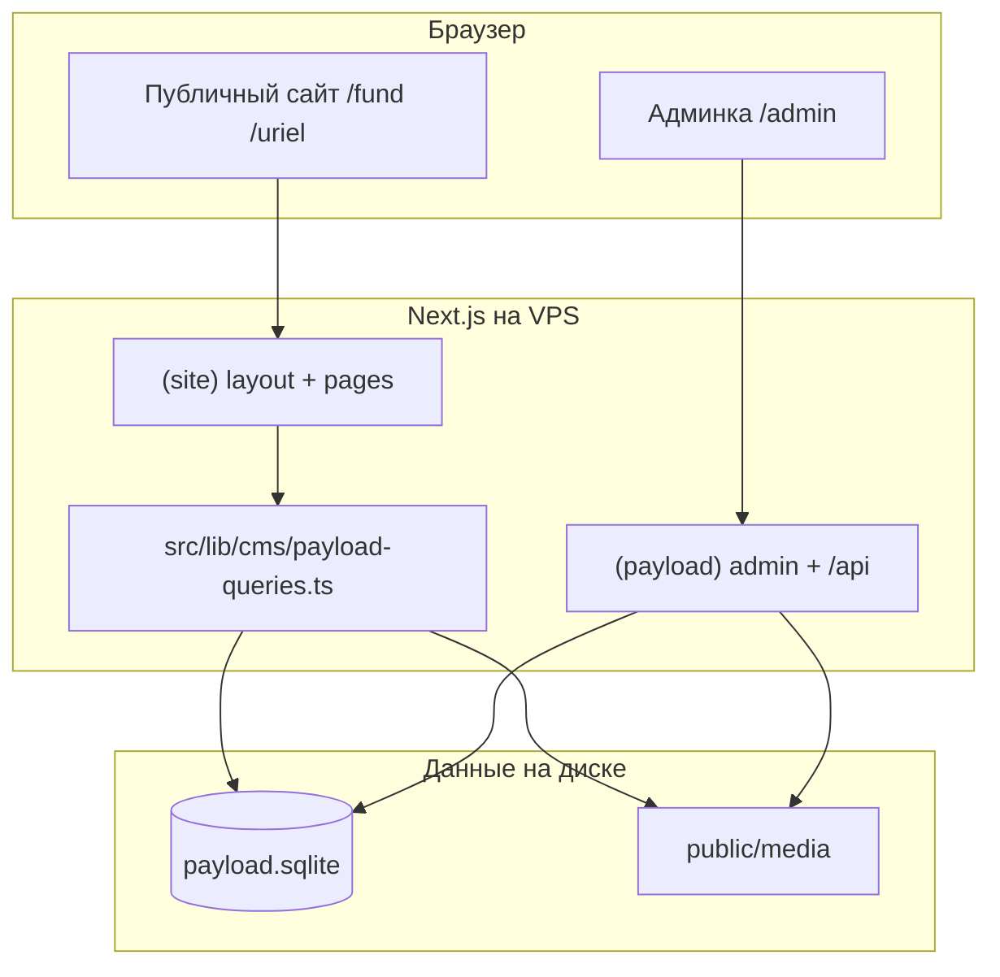

# charity-portal — sevcrf.ru

Официальный сайт **Севастопольского городского фонда Рерихов** и центра детского творчества **«Уриэль»**.

- Прод: https://sevcrf.ru  
- Админка: https://sevcrf.ru/admin  
- Репозиторий: Next.js 16 (App Router) + **Payload CMS 3** (SQLite, локальные файлы)

Этот документ — карта проекта для разработчиков и для ИИ-ассистентов: где что лежит, откуда берётся контент, как деплоить и бэкапить.

---

## Кратко: как устроен контент

| Что | Где хранится | В git? |
|-----|----------------|--------|
| Тексты, карточки, галереи, книги, видео… | `payload.sqlite` + таблицы Payload | **Нет** |
| Загруженные изображения/PDF | `public/media/` (коллекция Media) | **Нет** (только `.gitkeep`) |
| Код сайта и схема CMS | этот репозиторий | Да |
| Статичные картинки (фоны главной, библиотека) | `public/*.jpg`, `public/library.ts` | Да |
| Первичные данные для сида (legacy) | `src/data/*.ts` | Да (только для скриптов) |

**Источник правды на проде:** `payload.sqlite` + `public/media/`.  
Перенос между машинами: `npm run payload:backup` → архив → `npm run payload:restore`.

---

## Стек

- **Next.js 16** — App Router, React 19  
- **Payload CMS 3** — админка, SQLite (`@payloadcms/db-sqlite`)  
- **Tailwind CSS 4**  
- **Деплой:** GitHub Actions → VPS, **PM2** (`ecosystem.config.cjs`, процесс `sevcrf`)  
- **Домен:** Nginx (вне репозитория) проксирует на `:3000`

---

## Архитектура



### Два корневых layout в App Router

| Группа | Путь | Назначение |
|--------|------|------------|
| `(site)` | `src/app/(site)/` | Публичный сайт, свой `<html>` |
| `(payload)` | `src/app/(payload)/` | Payload `RootLayout`, админка, REST `/api/*` |

Не вкладывать `<html>` в `(site)` внутрь Payload — уже разделены.

### Чтение CMS на сайте

Все запросы к БД — через **`src/lib/cms/payload-queries.ts`**:

- `getPayload({ config })` из `@payload-config`
- типы представлений: `BookView`, `FundExhibitionView`, `UrielExhibitionView`, …
- `mediaUrl()` — URL файла из поля upload (`/api/media/file/...`)

Страницы с контентом из Payload помечены:

```ts
export const dynamic = "force-dynamic";
```

Иначе `next build` в CI без данных в SQLite падает (пустая БД при сборке).

---

## Структура каталогов

```
charity-portal/
├── payload.config.ts          # Конфиг Payload (коллекции, globals, SQLite)
├── ecosystem.config.cjs       # PM2 на сервере
├── .env.example               # Шаблон переменных (копировать в .env.local)
├── .github/workflows/deploy.yml
│
├── public/                    # Статика Next.js
│   ├── media/                 # Загрузки Payload (в git только .gitkeep)
│   ├── hero-bg.jpg, fond-bg.jpg, uriel-bg.jpg
│   ├── biblio.jpg
│   └── library.ts             # Данные страницы библиотеки (пока не в CMS)
│
├── src/
│   ├── app/
│   │   ├── (site)/            # Публичные страницы
│   │   ├── (payload)/         # Admin + API Payload
│   │   └── api/og/            # Динамические OG-картинки
│   ├── components/            # UI: Navbar, галереи, ExhibitionMasonryGallery…
│   ├── lib/
│   │   ├── cms/payload-queries.ts
│   │   ├── images.ts          # optionalWebpSrc — webp только для legacy-путей
│   │   └── format-text.tsx    # **жирный** и *курсив* в текстах globals
│   ├── payload/
│   │   ├── collections/       # Схемы коллекций CMS
│   │   ├── globals/           # О нас, музей
│   │   └── access/
│   └── data/                  # Legacy TS-массивы ТОЛЬКО для seed:cms (не runtime)
│
├── scripts/
│   ├── backup-payload.sh / restore-payload.sh
│   ├── seed-payload-cms.ts
│   ├── seed-site-globals.ts
│   ├── migrate-uriel-exhibition-photos.ts
│   ├── migrate-club-photos.ts
│   └── lib/payload-media.ts
│
└── backups/                   # Архивы payload:backup (в .gitignore)
```

---

## Payload CMS: коллекции и globals

Админка: **https://sevcrf.ru/admin** (логин — коллекция `users`).

### Коллекции (группа в админке)

| Slug | Группа | Страница сайта |
|------|--------|----------------|
| `books` | Fund | `/fund/books` |
| `gallery` | Fund | `/fund/gallery` |
| `videos` | Fund | `/fund/videos` |
| `exhibitions-fund` | Fund | `/fund/exhibitions` |
| `conferences` | Fund | `/fund/science/conferences` (видео докладов) |
| `lectures` | Fund | `/fund/science/lectures` |
| `exhibitions-uriel` | Uriel | `/uriel/exhibitions` (+ фото в поле `photos`) |
| `crafts` | Uriel | `/uriel/works/crafts` |
| `diplomas` | Uriel | `/uriel/diplomas` |
| `ships-models` | Uriel | `/uriel/works/models` |
| `club-gallery` | Uriel | `/uriel/clubs/art`, `/uriel/clubs/ships` (`club`: `art` \| `techmodel`) |
| `media` | — | файлы загрузок |

### Globals (раздел «Страницы»)

| Slug | URL |
|------|-----|
| `fund-about` | `/fund/about` |
| `uriel-about` | `/uriel/about` |
| `fund-museum` | `/fund/museum` |

В globals для длинных текстов: `**жирный**`, `*курсив*` (см. `renderFormattedText`).

### Ещё не в CMS (статика в коде / файлах)

| Раздел | Где править |
|--------|-------------|
| Главная `/` | `src/app/(site)/HomeClient.tsx`, фоны `public/*-bg.jpg` |
| Библиотека `/fund/library` | `public/library.ts` + `LibraryContent.tsx` |
| Архив конференций (eLibrary, годы) | захардкожен в `ConferenceClient.tsx` |
| Навигация, SEO-оболочки | `Navbar.tsx`, `metadata` в `page.tsx` |

---

## Карта URL сайта

### Фонд (`/fund`)

| URL | Данные |
|-----|--------|
| `/fund` | статичная витрина |
| `/fund/about` | global `fund-about` |
| `/fund/museum` | global `fund-museum` |
| `/fund/library` | `public/library.ts` |
| `/fund/books` | `books` |
| `/fund/gallery` | `gallery` |
| `/fund/videos` | `videos` |
| `/fund/exhibitions` | `exhibitions-fund` |
| `/fund/science/conferences` | `conferences` + статичный блок архива |
| `/fund/science/lectures` | `lectures` |

### Уриэль (`/uriel`)

| URL | Данные |
|-----|--------|
| `/uriel` | статичная витрина |
| `/uriel/about` | global `uriel-about` |
| `/uriel/exhibitions` | `exhibitions-uriel` |
| `/uriel/works/crafts` | `crafts` |
| `/uriel/works/models` | `ships-models` |
| `/uriel/diplomas` | `diplomas` |
| `/uriel/clubs/art` | `club-gallery` (`art`) |
| `/uriel/clubs/ships` | `club-gallery` (`techmodel`) |

---

## Локальная разработка

### Требования

- Node.js 20+
- npm

### Первый запуск

```bash
git clone <repo>
cd charity-portal
cp .env.example .env.local
# Заполните PAYLOAD_SECRET (длинная случайная строка)

npm install
```

**Вариант A — с бэкапа прода (рекомендуется):**

```bash
# Положите архив в backups/ и:
npm run payload:restore -- backups/payload-bundle-XXXXXXXX.tar.gz
npm run dev
```

**Вариант B — пустая БД + сиды:**

```bash
npm run payload:seed-site-pages      # О нас + музей
npm run payload:migrate-club-photos  # кружки (нужны были public/drawing, techmodel — из архива)
# Полный контент: восстановите архив или seed:cms с legacy-файлами
npm run dev
```

- Сайт: http://localhost:3000  
- Админка: http://localhost:3000/admin — создайте первого пользователя, если БД пустая.

### Сборка

```bash
npm run build
npm run start
```

`PAYLOAD_SECRET` нужен и для `build` (CI тоже).

---

## Переменные окружения

Файл **`.env.local`** (локально) или **`.env`** на сервере (`/var/www/sevcrf/.env`):

| Переменная | Обязательно | Описание |
|------------|-------------|----------|
| `PAYLOAD_SECRET` | да (prod) | Секрет сессий Payload. **Одинаковый** на сервере и в GitHub Secret `PAYLOAD_SECRET` |
| `DATABASE_URL` | нет | По умолчанию `file:./payload.sqlite` |

Пример: `.env.example`.

---

## NPM-скрипты

| Команда | Назначение |
|---------|------------|
| `npm run dev` | Dev-сервер |
| `npm run build` | Production-сборка |
| `npm run start` | Запуск собранного приложения |
| `npm run lint` | ESLint |
| `npm run payload` | CLI Payload |
| `npm run generate:types` | `src/payload/payload-types.ts` после смены схемы |
| `npm run generate:importmap` | после смены компонентов админки |
| **`npm run payload:backup`** | Архив `payload.sqlite*` + `public/media` → `backups/` |
| **`npm run payload:restore -- <архив>`** | Восстановление из `.tar.gz` |
| `npm run payload:orphans` | Файлы в `public/media` без записи в БД |
| `npm run payload:seed-site-pages` | Заполнить globals (О нас, музей) |
| `npm run payload:migrate-club-photos` | Кружки → CMS (legacy-папки удалены из репо) |
| `npm run payload:migrate-uriel-exhibitions` | Фото выставок Уриэль (legacy `public/exhibitions` удалена) |
| `npm run seed:cms` | Полный импорт из `src/data/*` (нужны legacy-файлы или архив) |
| `npm run optimize:images` | No-op (legacy-папки удалены) |

Скрипты миграции/сида с `NODE_ENV=production` в `package.json` — **не запускать при активном `npm run dev`** (конфликт SQLite schema push). Остановите dev, выполните команду, снова `npm run dev`.

---

## Деплой (GitHub Actions → VPS)

Файл: `.github/workflows/deploy.yml`  
Триггер: push в **`main`**.

### GitHub Secrets

| Secret | Назначение |
|--------|------------|
| `SERVER_IP` | IP VPS |
| `SERVER_USER` | SSH-пользователь |
| `SSH_PRIVATE_KEY` | Приватный ключ SSH |
| `PAYLOAD_SECRET` | Тот же, что в `.env` на сервере (для `npm run build`) |

### Что делает workflow

1. `npm ci` + `npm run build` (с `PAYLOAD_SECRET`, пустая/локальная SQLite в CI).
2. На сервере **бэкап** `payload.sqlite*` и `public/media` → `.deploy-backup/`.
3. Удаляется только **`.next`** (не трогает БД и media).
4. **SCP** на `/var/www/sevcrf`: `.next`, `public`, **`src`**, `scripts`, конфиги, `package.json`.
5. **Восстановление** БД и media из `.deploy-backup/`.
6. `npm install --omit=dev`, **PM2** `sevcrf`.

Каталог на сервере: **`/var/www/sevcrf`**.

---

## Сервер: полезные команды

Подключение (пример):

```bash
ssh user@YOUR_SERVER_IP
cd /var/www/sevcrf
```

### PM2

```bash
pm2 status
pm2 logs sevcrf --lines 50
pm2 restart sevcrf
pm2 save
```

Конфиг: `ecosystem.config.cjs`, порт **3000**.

### Проверка после деплоя

```bash
test -f .env && echo "OK .env"
test -f payload.sqlite && ls -lh payload.sqlite
du -sh public/media
ls src/payload/collections | head
curl -s -o /dev/null -w "%{http_code}\n" http://127.0.0.1:3000/
curl -s -o /dev/null -w "%{http_code}\n" http://127.0.0.1:3000/admin
```

### Бэкап на сервере (обязательно по расписанию)

```bash
cd /var/www/sevcrf
npm run payload:backup
# Скопировать архив с VPS наружу, например:
# scp user@server:/var/www/sevcrf/backups/payload-bundle-*.tar.gz ./
```

Рекомендация: cron раз в сутки + хранение копий вне VPS (облако, другой диск).

Пример cron (от пользователя, который владеет проектом):

```cron
0 3 * * * cd /var/www/sevcrf && /usr/bin/npm run payload:backup >> /var/log/sevcrf-backup.log 2>&1
```

### Восстановление на сервере

```bash
cd /var/www/sevcrf
pm2 stop sevcrf
npm run payload:restore -- backups/payload-bundle-XXXXXXXX.tar.gz
pm2 start ecosystem.config.cjs
```

### Ручной бэкап перед рискованными действиями

```bash
cp -a payload.sqlite payload.sqlite.manual-$(date +%Y%m%d)
cp -a public/media public/media.manual-$(date +%Y%m%d)
```

### Осиротевшие файлы media

```bash
npm run payload:orphans
# Удалять только после backup и проверки списка
```

### Переменные на сервере

```bash
grep -E '^PAYLOAD_SECRET|^DATABASE_URL' .env
```

`PAYLOAD_SECRET` на сервере и в GitHub Actions **должны совпадать**, иначе после деплоя сессии админки сбросятся.

---

## Что не коммитить

См. `.gitignore`:

- `.env*`, `payload.sqlite*`
- `public/media/*` (кроме `.gitkeep`)
- `backups/`
- `.next/`, `node_modules/`

**Никогда** не коммитить `payload.sqlite` и прод-медиа в git.

---

## Legacy и миграции (история проекта)

Раньше контент лежал в `public/gallery`, `public/sgfr`, `public/exhibitions`, `public/drawing` и т.д.  
Сейчас всё перенесено в **Payload**; папки из репозитория **удалены** (~900 МБ).

| Этап | Скрипт |
|------|--------|
| Первичный импорт (устарел без архива) | `npm run seed:cms` |
| Фото выставок Уриэль | `npm run payload:migrate-uriel-exhibitions` |
| Фото кружков | `npm run payload:migrate-club-photos` |
| Страницы О нас / музей | `npm run payload:seed-site-pages` |

Повторный запуск миграций без `--force` пропускает уже заполненные записи.

`src/data/*.ts` — только справочники для `seed:cms`, **сайт их не импортирует**.

---

## UI: важные детали

- **Картинки Payload** отдаются как `/api/media/file/...`. В `<picture>` **не** подставлять `.webp` для таких URL — см. `src/lib/images.ts` (`optionalWebpSrc`).
- Галереи выставок: `ExhibitionMasonryGallery`, кружки: `ClubMasonryGallery`.
- OG: `src/app/api/og/route.tsx`, шрифт `public/fonts/font.ttf`.

---

## Типичные задачи сопровождения

1. **Правка текста на странице «О нас»** → админка → Globals → Fund About / Uriel About.  
2. **Новая книга / фото галереи** → соответствующая коллекция в админке.  
3. **Деплой кода** → push в `main`, дождаться Actions.  
4. **Перенос сайта на новый сервер** → код + `payload:restore` + тот же `PAYLOAD_SECRET` + `.env`.  
5. **После смены полей в Payload** → `npm run generate:types`, при необходимости `generate:importmap`, обновить `payload-queries.ts` и страницы.

---

## Зависимости и версии

См. `package.json`. Ключевые: `next@16`, `payload@3`, `@payloadcms/db-sqlite`, `react@19`.

Обновлять Payload/Next осторожно: проверять [Payload migrations](https://payloadcms.com/docs) и прогонять `build` + админку локально.


-------

## Контакты и домен

- Сайт: **sevcrf.ru**  
- Организации: СГФР, СГЦДТ «Уриэль» им. Н.К. Рериха (Севастополь)

При сомнениях по инфраструктуре смотрите также `.env.example` и комментарии в `scripts/*.sh`, `.github/workflows/deploy.yml`.
